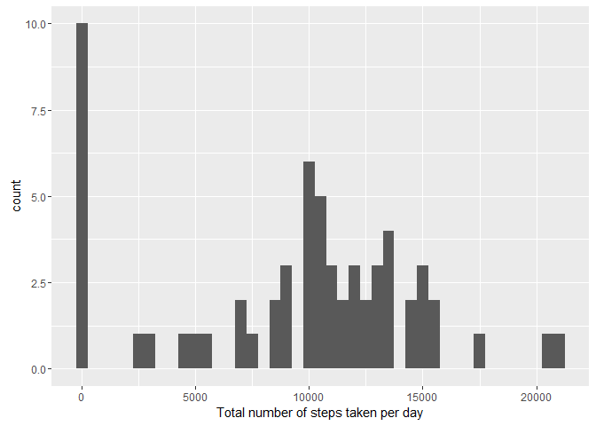
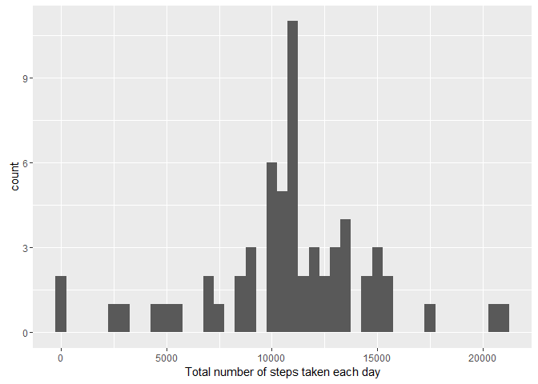

# RepAssignment1-Daily Activity
Okja Kim  
November 18, 2016  


RepAssignment1
==============

## Daily Activity

###Loading and Processing the data


```r
unzip("activity.zip")
```

```
## Warning in unzip("activity.zip"): error 1 in extracting from zip file
```

```r
dataPA<- read.csv('Activity.csv', stringsAsFactors = FALSE)
dataPA$Date <- as.Date(dataPA$date)
```

###Mean and Median total number of steps taken per day

```r
library(ggplot2)
```

```
## Warning: package 'ggplot2' was built under R version 3.2.4
```

```r
totalSteps<- tapply(dataPA$steps, dataPA$Date, FUN = sum, na.rm=TRUE)
qplot(totalSteps, binwidth=500, xlab = "Total number of steps taken per day")
```

<!-- -->

Mean total number of steps taken per day:

```r
mean(totalSteps, na.rm = TRUE)
```

```
## [1] 9354.23
```

Median total number of steps taken per day:

```r
median(totalSteps, na.rm = TRUE)
```

```
## [1] 10395
```

###The average daily activity pattern

```r
averageSteps<- aggregate(x=list(steps=dataPA$steps), by=list(interval=dataPA$interval),
                         FUN=mean, na.rm=TRUE)
ggplot(averageSteps, aes(interval, steps))+geom_line()+xlab("5-minute interval")+ylab("average number of steps taken")
```

<!-- -->

On average across all the days in the dataset, the 5-minute interval contains the maximum number of steps:

```r
averageSteps[which.max(averageSteps$steps),]
```

```
##     interval    steps
## 104      835 206.1698
```


###Imputing missing values
There are a number of days/intervals where there are missing values.


```r
intervalsMissingValue<- is.na(dataPA$steps)
table(intervalsMissingValue)
```

```
## intervalsMissingValue
## FALSE  TRUE 
## 15264  2304
```

```r
length(which(intervalsMissingValue))
```

```
## [1] 2304
```
intervals where there are missing values.

Creating a new dataset that is equal to the original set but with the missing value filled in with the mean for that 5-minute intervals...

```r
newValue<-function(interval, steps){
    val<-steps
    if(is.na(val)) val<- averageSteps[averageSteps$interval==interval, "steps"]
    return(val)
}
newDataPA<- dataPA
newDataPA$steps<- mapply(newValue, newDataPA$interval, newDataPA$steps)
```

With the new dataset, histogram of the total number of steps taken

```r
tSteps<- tapply(newDataPA$steps, newDataPA$date, FUN = sum)
qplot(tSteps,binwidth=500, xlab = "Total number of steps taken each day")
```

<!-- -->

Mean total number of steps taken per day:

```r
mean(tSteps, na.rm = TRUE)
```

```
## [1] 10766.19
```

Median total number of steps taken per day:

```r
median(tSteps, na.rm = TRUE)
```

```
## [1] 10766.19
```

The impact of imputting missing data on the estimates of the total daily number of steps is that the mean and median are higher than the original dataset.


###The differences in activity patterns between weekdays and weekends

```r
weekdayWeekend<- function(date){
  if (weekdays(date) %in% c("Monday","Tuesday","Wednesday","Thursday","Friday"))
      return("weekday") else if (weekdays(date) %in% c("Saturday","Sunday"))
          return("weekend") else stop("invalid date")
}
newDataPA$day <- sapply(newDataPA$Date, FUN = weekdayWeekend)
```

Making a panel plot containing a time series plot of the 5-minute interval amd the average number of steps taken, averaged across all weekday days of weekend days...

```r
ave<- aggregate(steps~interval+day, data = newDataPA, mean)
ggplot(ave, aes(interval, steps))+geom_line()+facet_grid(day~.)+xlab("5-minute interval")+ylab("Number of steps")
```

<!-- -->

